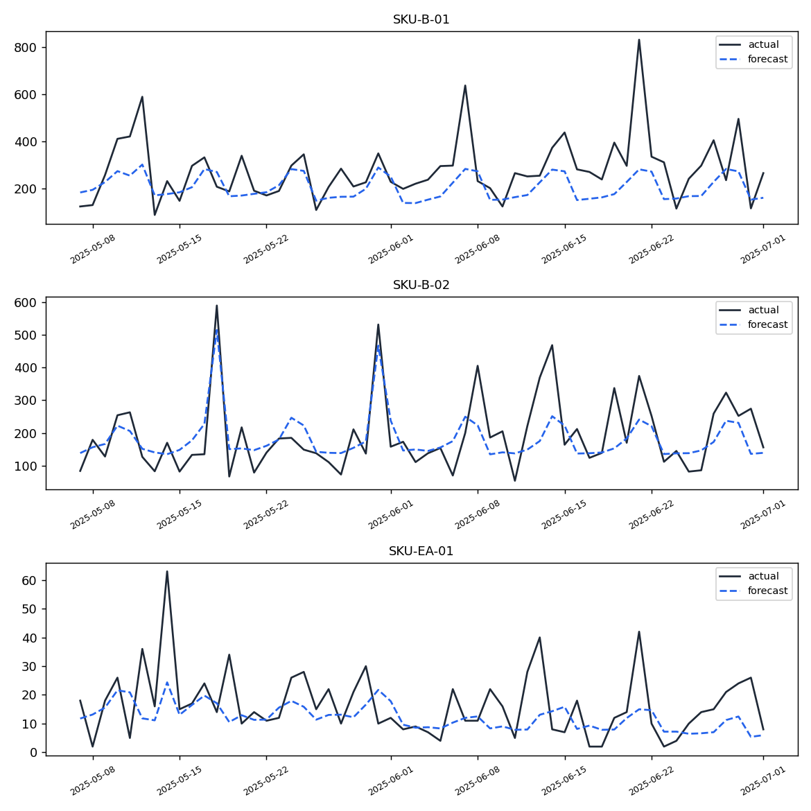

# Demand Forecasting + Inventory Optimizer

Daily sales history for 25 SKUs, turned into per-SKU demand forecasts *and* the reorder decisions those
forecasts should drive — safety stock, reorder point, and order quantity, computed from the forecaster's
own point estimate and its own backtested uncertainty, not a hardcoded buffer.

```
sales.csv + sku_metadata.csv
        |
        v
  calendar + lag/rolling features  (features.py)
        |
        v
  global XGBoost model  <----- vs -----  seasonal-naive baseline
  (25 SKUs, one model)                   (same day last week)
        |                                        |
        +------------ recursive backtest ------- +
        |            (model.py / baseline.py)
        v
  metrics.json, backtest_predictions.csv, forecast_vs_actual.png
        |
        v
  safety stock / reorder point / EOQ   (optimize.py, uses the
        |                               backtest's own error std dev)
        v
  reorder_recommendations.csv  +  FastAPI  /forecast/{sku}  /reorder/{sku}
```

## Why this exists

Two ideas usually get built separately: a forecasting notebook that stops at an accuracy number, and an
inventory-optimization spreadsheet with a manually-typed "safety buffer" percentage. The entire point of
this project is the handoff between them:

- **Safety stock computed from the model's own uncertainty, not a guess.** `optimize.py` uses the
  standard `z * sigma_LT` formula, but `sigma_LT` comes from `sigma`, the *actual* standard deviation of
  this model's forecast errors on the held-out backtest window, per SKU — not the raw historical demand
  std dev (which would double-count seasonality and promo variance the model already explains). A SKU
  the model forecasts well gets a small safety stock; one it forecasts poorly gets a bigger one,
  automatically. `tests/test_optimize.py::test_safety_stock_increases_with_forecast_uncertainty` pins
  this relationship down directly.
- **A real design tradeoff: recursive, not vectorized, forecasting.** The model's features include
  `lag_7`/`lag_14`/... and rolling means. Building those once over the full history and scoring
  row-by-row would let a test-period row's lag feature quietly come from an *actual* value a few days
  later in the same test window — information a real deployment wouldn't have yet. `model.py`'s
  `recursive_forecast` instead walks the horizon one day at a time, feeding each day's prediction back in
  as "history" before computing the next day's features. This is the only way to get a backtest number
  that means what it claims to mean, and it's what made the honestly-evaluated accuracy noticeably worse
  than a first (leaky) version during development — a real, useful finding, not a bug to hide.
  `api.py` reuses the exact same function to forecast forward from the end of the real data, so backtest
  and live serving share one code path.
- **A held-out period that's actually held out.** The last 56 days of *each SKU's* series are excluded
  from training entirely (a time-based split, never a random row split, which would leak future rows into
  training via lag features) and evaluated once.

## The data

Real point-of-sale data can't ship in a public repo, so `data/generate_data.py` builds a statistically
realistic stand-in: **25 SKUs across 5 categories** (Beverages, Snacks, Household, Electronics-Accessories,
Personal-Care), **913 days** (~2.5 years) of daily history each, with real structure per SKU rather than
one master curve scaled up or down:

- a per-SKU **trend** (up / down / flat — e.g. Electronics-Accessories always trends up, Household is
  always flat)
- **weekly seasonality** specific to the category (Beverages/Snacks are weekend-heavy; Household is
  weekday-heavy; Personal-Care is flat)
- an **annual seasonality bump** at a category-specific time of year (Beverages peak in July, Snacks and
  Electronics-Accessories peak around the December holidays, Personal-Care bumps in January)
- random **promotional days** (`promo_flag`) with a 1.5–3x multiplicative spike
- **negative-binomial count noise** around the deterministic signal above (mean = the signal, variance >
  mean), the statistically correct shape for retail demand — not Gaussian noise bolted onto a formula.
  Over half the SKUs are measurably over-dispersed relative to a Poisson process
  (`tests/test_data_generation.py::test_demand_is_overdispersed_not_poisson`).

`data/generate_data.py` also writes `sku_metadata.csv`: per-SKU `unit_cost`, `holding_cost_rate` (annual,
as a fraction of unit cost), `ordering_cost`, and `lead_time_days` — the business assumptions a real
company would pull from its ERP, here documented as explicit per-category ranges in the generator itself.

```bash
python data/generate_data.py --n-days 913        # -> data/raw/sales.csv, data/raw/sku_metadata.csv
```

## Results

Global XGBoost model (lag + rolling + calendar + promo + category features, trained across all 25 SKUs
at once) vs. a seasonal-naive baseline ("same day last week"), both forecast **recursively** over a
56-day, per-SKU held-out window never seen during training:

| Metric | XGBoost (global) | Seasonal-naive baseline |
|---|---|---|
| WAPE | **36.76%** | 52.83% |
| MAPE | 47.27% | 81.76% |
| RMSE | 45.44 | 60.45 |

The model beats the naive baseline's WAPE by **30.4%** (relative improvement). Per-SKU WAPE ranges from
24.6% (easiest SKU) to 58.0% (hardest — a low-volume, highly-promoted SKU where a handful of large promo
spikes dominate the error), median 36.8%. Full per-SKU numbers are in `reports/metrics.json`.

WAPE (not MAPE) is the metric that matters here: several SKUs have near-zero-demand days, and plain MAPE
inflates on those (any single low-demand day with `actual=1` and `forecast=2` is a "100% error" even
though it's off by one unit) — reported for comparability, but WAPE is what decided "did the model
actually help."

**Actual vs. forecast, 3 representative SKUs over the test window:**



The model tracks the weekly rhythm and the general level well; it systematically under-shoots the tallest
promo spikes (visible on `SKU-B-01`/`SKU-B-02`) because a promo day's *size* is noisy even when its
*timing* (`promo_flag`) is known — a real, honest limitation, discussed further below.

**Example reorder recommendations** (95% target service level, from `reports/reorder_recommendations.csv`):

| SKU | Category | Lead time | Avg daily demand (fcst) | Forecast error std | Safety stock | Reorder point | EOQ |
|---|---|---|---|---|---|---|---|
| SKU-B-01 | Beverages | 5d | 245.7 | 111.0 | 408.2 | 1636.9 | 2360.6 |
| SKU-H-01 | Household | 9d | 14.5 | 8.2 | 40.2 | 170.9 | 485.7 |
| SKU-EA-01 | Electronics-Accessories | 18d | 11.8 | 10.7 | 74.6 | 286.8 | 208.5 |
| SKU-PC-02 | Personal-Care | 6d | 13.5 | 6.0 | 24.2 | 105.3 | 424.2 |

`SKU-EA-01` and `SKU-B-01` make the point directly: `SKU-EA-01` has *lower* average daily demand than
`SKU-B-01` but a *long* 18-day lead time and a forecast error std dev that's ~90% of its own average
demand (a genuinely hard-to-forecast, slow-moving SKU) — both push its safety stock up relative to its
volume, exactly what a reorder policy should do.

## Run it

```bash
pip install -r requirements-dev.txt

python data/generate_data.py --n-days 913              # 1. synthetic data
PYTHONPATH=src python -m demand_forecast.forecast       # 2. features -> train -> recursive backtest -> eval
PYTHONPATH=src python -m demand_forecast.optimize        # 3. safety stock / reorder point / EOQ
PYTHONPATH=src uvicorn demand_forecast.api:app --reload  # 4. serve
```

or, with `make`:

```bash
make install && make all && make serve
```

### API

```bash
curl -s "localhost:8000/forecast/SKU-B-01?horizon_days=14" | python3 -m json.tool
curl -s "localhost:8000/reorder/SKU-EA-01?service_level=0.95" | python3 -m json.tool
```

```json
{
  "sku_id": "SKU-EA-01",
  "category": "Electronics-Accessories",
  "lead_time_days": 18,
  "service_level": 0.95,
  "avg_daily_demand_forecast": 11.79,
  "forecast_daily_std": 10.69,
  "safety_stock": 74.6,
  "reorder_point": 286.8,
  "economic_order_qty": 208.48,
  "unit_cost": 42.38
}
```

Interactive docs at `localhost:8000/docs`. Other endpoints: `GET /health`, `GET /skus`.

### Docker

```bash
docker build -t demand-forecast-optimizer .
docker run -p 8000:8000 demand-forecast-optimizer
```

The image generates data, trains, and computes reorder recommendations during build, so `docker run`
alone is a working, served API — no volume mount or separate setup step required.

## Project layout

```
data/generate_data.py             synthetic multi-SKU sales + SKU metadata generator
src/demand_forecast/
  config.py                       every path + hyperparameter, in one place, env-var overridable
  features.py                     calendar + lag/rolling feature engineering (leakage-safe)
  model.py                        global XGBoost model, recursive multi-step forecasting
  baseline.py                     seasonal-naive baseline (recursive, for a fair comparison)
  metrics.py                      MAPE / WAPE / RMSE
  forecast.py                     CLI: split -> train -> backtest -> evaluate -> save artifacts + plot
  optimize.py                     safety stock / reorder point / EOQ, CLI + pure functions
  api.py                          FastAPI app
  schemas.py                      pydantic request/response models
tests/                            47 tests: data generation, feature leakage, baseline, end-to-end
                                   forecast pipeline, inventory-optimization math, and the API
reports/                          metrics.json, backtest_predictions.csv, forecast_vs_actual.png,
                                   reorder_recommendations.csv (all from a real run)
models/                           forecast_model.json (XGBoost native format) + feature_manifest.json
.github/workflows/ci.yml          lint + test + a small end-to-end pipeline smoke run, on every push
```

## Tests

```bash
pytest -v                                              # 47 tests
pytest --cov=demand_forecast --cov-report=term-missing # 98% line coverage
ruff check .                                            # clean
```

## What I'd do next in production

- **Real lead-time data instead of a fixed assumption.** `lead_time_days` here is a static per-SKU number;
  a real supplier's lead time varies, and safety stock should account for *lead-time* variance too, not
  just demand variance (the combined-variance safety-stock formula), using actual receiving records.
- **Promotion-aware forecasting via exogenous regressors.** The model already treats `promo_flag` as
  known-in-advance, which is realistic, but it only has one bit of information (on/off) — a real system
  would add planned discount depth and promo type as features, which should shrink the promo-spike
  under-forecasting visible in the plot above.
- **Backtesting across multiple rolling windows**, not one 56-day window, to see whether accuracy is
  stable across seasons (e.g. does the model hold up forecasting *into* the December holiday bump, not
  just an arbitrary spring window like the one reported here) — a proper rolling-origin backtest.
- **Multi-echelon inventory** (warehouse -> store) instead of a single stocking point per SKU, and a
  joint reorder policy across correlated SKUs (e.g. substitutable products) instead of treating each SKU
  independently.
- **Incremental feature updates in the API** instead of recomputing lag/rolling features over the full
  history on every `/forecast` call — fine for a 25-SKU demo, not for a large catalog at low latency.
